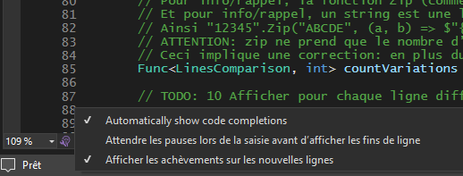

# Travail planifié, semaine #40

## Checkpoint #4

Cette fois, c'est le checkpoint complet! Durée: 20 minutes max

## Formative

L'exercice diffit vous permet de ré-exercer les concepts essentiels du module selon les même modalités que le test qui aura lieu la semaine prochaine

Marche à suivre:

- Sync Fork + Pull
- Copie du dossier [diffit](../exos/diffit/) dans votre espace personnel + commit de début d'exercice
- Un commit à chaque TODO implémenté

Tout comme durant l'épreuve, le recours à l'IA est interdit.  
Tout accès à une IA, même involontaire, entraîne la perte d'un joker.  
Pour éviter un accès à Copilot à votre insu, décochez toutes les cases de la saisie automatique en bas à gauche de Visual Studio:  
  
Je ferai usage d'Impero durant les deux tests.

Le corrigé se trouve dans le fichier `.zip` du repo, le mot de passe vous sera transmis en fin de matinée
